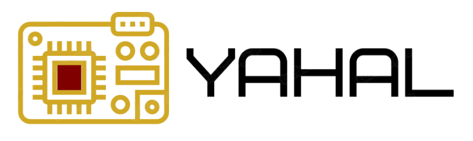
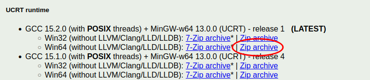
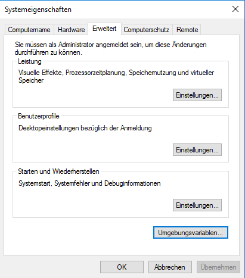
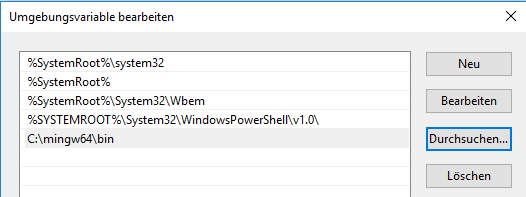
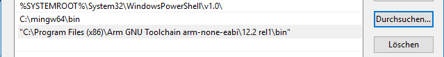
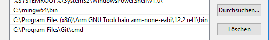
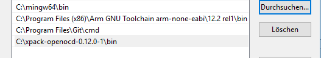

  <a href="https://git.fh-aachen.de/Terstegge/YAHAL" target="_blank" rel="noopener noreferrer">
    <picture>
      <source media="(prefers-color-scheme: dark)" srcset="doc/assets/YAHAL_logo.png">
      
    </picture>
  </a>
  <h1>YAHAL - Another Hardware Abstraction Library</h1>

## Documentation

Visit [https://terstegge.pages.fh-aachen.de/YAHAL](https://terstegge.pages.fh-aachen.de/YAHAL) to view the full API 
documentation.

## Getting Started

### 1. MinGW64 (Minimalist GNU for Windows)
When using Windows, a rudimentary Unix environment (MinGW64) must be installed first.
For this we use [WinLibs](https://winlibs.com/), from whose site you can download the latest ZIP file with UCRT runtime 
and without LLVM support:

Unpack this ZIP file under `C:\`. Make sure that afterwards a new directory `C:\mingw64`
is existing.

In order for the MinGW programs to work on the command line, the corresponding paths to the programs must be entered
in the path environment variable.
To do this, start the system properties and click on the 'Environment variables' button under the 'Advanced' tab
(see image below).

Then select the `PATH` environment variable in the lower area of the newly opened window and click on
'Edit'.

Add the path `C:\mingw64\bin` to the list.
You can use the 'New' and 'Browse' buttons to do this. 
_Tip:_ In case of strange behavior (entries in the list are overwritten), it helps to first enter something in a new field
(e.g. "C:") before clicking on 'Browse'.

At the end, the window for editing the path environment variable should look something like this:

_Note:_ You will need to add new elements into the PATH environment variable in the following steps as well!

When using Linux or MacOS, please ensure that the tools `gcc`, `g++`, `make` and `cmake` are installed.
To do this, use the package management of your operating system.

### 2. ARM GNU Toolchain (ARM Cross-compiler)
At https://developer.arm.com/Tools%20and%20Software/GNU%20Toolchain you will find a button 'Download Arm GNU Toolchain'.
For your platform (Windows, Linux, MacOS), download the latest 'bare metal target' version (the name of the file **must** 
contain `arm-none-eabi`).
Make sure you have the correct processor architecture (x86_64, aarch32/64). 
For Windows there is an .exe file with an installer:

(e.g. `arm-gnu-toolchain-14.3.rel1-mingw-w64-i686-arm-none-eabi.exe`)

When using Windows, run this .exe file and follow the instructions in the installer (no changes to the default settings
are necessary!).
After completing the installation, you need to extend the PATH environment variable (see above). 
The window for the path environment variable will then look like this, for example:

When using Linux or MacOS, either install the corresponding version from the page above, or install the GNU ARM 
Cross-compiler via the package management of your operating system.

### 3. git
At https://git-scm.com/download/ you will find the latest 64-bit version of git for Windows, which you can install
without modifying the installer settings. 
The installation should automatically update the path environment variable:

On Linux and MacOS, please make sure that git is installed.
Use the package management of your operating system to do this.

### 4. OpenOCD
OpenOCD (Open On-Chip Debugger) is a tool that we need in order to download and debug programs on our microcontroller.

The latest OpenOCD version v0.12.0 does **not** yet support the RP2350 microcontroller.
Therefore, it is either necessary to compile OpenOCD [from source](https://github.com/raspberrypi/openocd),
or to use a prebuild OpenOCD version provided by us.

If you want to use our prebuild version, please choose one of the following links depending on your OS:
- [Linux (x86_64)](https://git.fh-aachen.de/Terstegge/YAHAL/-/jobs/672598/artifacts/download)
- [Windows (x86_64)](https://git.fh-aachen.de/Terstegge/YAHAL/-/jobs/671025/artifacts/download)
- MacOS: Try to compile it yourself :-(

#### Installation: Linux
Unpack the downloaded zip file into e.g. `/usr/local/`. The child folder (in this case `/usr/local/bin`) must be in your PATH.

To run the binary, you require `libusb1` and `libhidapi`.
Please install these packages with your package manager. Examples for common distributions are:
- **Ubuntu**: `sudo apt update && sudo apt install libusb-1.0 hidapi`
- **Fedora**: `sudo dnf install libusb1 hidapi`

Run the command `openocd --help`.

If there is no output, run `ldd $(which openocd)` to see if there are still packages missing 
and install them accordingly.

#### Installation: Windows
Unpack the downloaded zip file into your MinGW64 installation at `C:\mingw64`.
If the PATH variable for MinGW64 is already set up, running `openocd.exe --help` should work.

Instructions for older microcontrollers.

At https://openocd.org/pages/getting-openocd.html you will find a link to (unofficial) binary packages for Windows:
https://github.com/xpack-dev-tools/openocd-xpack/releases.
To see all files, you have to click on 'show all assets' at the bottom of the file list on this page!
For Windows, select e.g. the ZIP file `xpack-openocd-0.12.0-1-win32-x64.zip`, which you download and extract e.g. 
to `C:\` (or another suitable location).  
As always, extend the path afterward:

When using Linux or MacOS, download the corresponding installation file (.tar.gz), extract it to a suitable location and 
make sure that the `bin` sub-folder is in the path (just like Windows).

### 5. Putty
PuTTY is a small program for Windows that we use in order to communicate with our microcontroller
(via a virtual serial interface).
At https://www.chiark.greenend.org.uk/~sgtatham/putty/latest.html you will find the latest msi file, which can be
simply installed. 
For Linux or MacOS, other programs can be used for communication (e.g. `GTKTerm` under Linux).

### 6. Zadig (USB Driver)

(Optional) Only necessary when working with the old MSP432 microcontroller.

For Windows, we also need a small utility program that installs USB drivers into the operating system.
This program is not necessary for Linux and MacOS!
Zadig can be downloaded from https://zadig.akeo.ie/ (it is a directly executable exe file).
Simply move this file to the directory `C:\mingw64\bin` so that this tool can also be found from the command line!

### 7. Editor or IDE
Generally, you should use an IDE. The IDE supported in this course is CLion (https://www.jetbrains.com/clion/).
Students of the FH Aachen have an 'academic license' with which the software can be used without restrictions.
Alternatively, you can of course also work with another IDE of your choice (e.g. VSCode) or an editor which does not
visually support the debugging of programs.

### 8. Verify the tools via command line
At this point, you should check that all important tools are installed correctly and can also be found from the 
command line.
To do this, open a new terminal window (`command.com` in Windows) and make sure that the following programs are executed
after the corresponding command has been entered manually:

`g++, make (or under Windows: mingw32-make), arm-none-eabi-g++, git , cmake, openocd, PuTTY, zadig-2.8 (only when working with MSP432)`

If these programs are not found, check the installation and the correctness of the entries in the PATH environment
variable!

<b>You should now have all the necessary programs installed!</b>

### 9. Clone YAHAL
The following step installs YAHAL, the software framework for our microcontroller used in this course.
If you have not already done so, clone YAHAL in your home directory (or another suitable location).
In a terminal you can enter e.g:

`git clone --recursive https://git.fh-aachen.de/Terstegge/YAHAL.git`

### 10. Execute example program
- Change the working directory: 
  `cd YAHAL/examples/rp2350-launchpad/blink_simple`
- Create a new subdirectory `build` and enter it: 
  `mkdir build` 
  `cd build`
- Call cmake: 
  for Windows: `cmake -G "MinGW Makefiles" ..` 
  for Linux/MacOS: `cmake ..`
- Compile the example program: 
  for Windows: `mingw32-make` 
  for Linux/MacOS: `make`

Now connect the RP2350 launchpad board to your computer.
Windows (unlike Linux and MacOS) does not have USB drivers for this device by
default. On newer Windows 10/11 installations it has been observed that a driver
for the RP2350 Lauchpad was automatically installed. In case you have problems
accessing the board, you might try to start `zadig-2.8` tool from the command
line. Click on the "Install Driver" button.
Then please be **patient** the program takes a few seconds to start working. 
Exit the program and **repeat** this step!

- Download and run the sample program: 
  for Windows: `mingw32-make upload_blink_simple` 
  for Linux/MacOS: `make upload_blink_simple`

If an **LED** now flashes on your board, you have done it!!!

  

